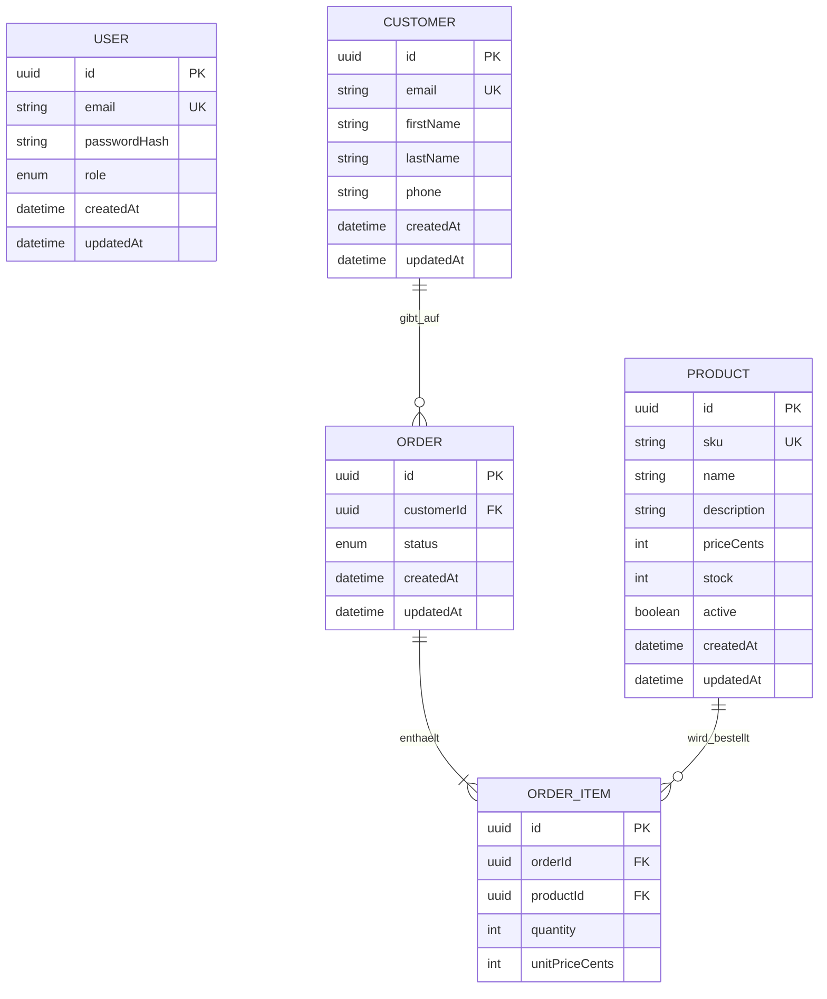

# Projektplan: Kunden- und Bestellverwaltung API

## 1. Projektidee

Die API dient der zentralen Verwaltung von Kunden, Produkten und Bestellungen für kleine Handelsunternehmen.

Viele kleine Unternehmen speichern diese Daten in unterschiedlichen Tabellen oder Dateien. Dadurch können doppelte Kundendaten, falsche Lagerbestände und schwer nachvollziehbare Bestellungen entstehen.

Die API soll eine einheitliche und geschützte Schnittstelle für diese Daten bereitstellen.

## 2. Zielgruppe

Die API richtet sich an:

- Mitarbeitende kleiner Handelsunternehmen;
- Administrator:innen;
- Entwickler:innen eines zukünftigen Web- oder Mobile-Clients.

## 3. Projektform

Das Projekt wird als Einzelprojekt entwickelt.

## 4. MVP

Die erste funktionsfähige Version umfasst:

- Anmeldung mit E-Mail und Passwort;
- Rollen `ADMIN` und `EMPLOYEE`;
- Kunden anlegen, lesen, aktualisieren und löschen;
- Produkte anlegen, lesen, aktualisieren und deaktivieren;
- Bestellungen mit mehreren Produkten erstellen;
- Bestellungen lesen und nach Status filtern;
- Suche und Paginierung;
- Validierung aller Eingabedaten;
- sichere Fehlerantworten;
- automatisierte Tests;
- Dokumentation;
- Deployment über HTTPS.

Nicht Bestandteil des MVP sind:

- ein Frontend;
- Online-Zahlungen;
- PDF-Rechnungen;
- E-Mail-Versand;
- die Anbindung an einen Versanddienstleister.

Diese Funktionen können später ergänzt werden.

## 5. Technologie-Stack

| Technologie | Verwendung          | Begründung                                                    |
| ----------- | ------------------- | ------------------------------------------------------------- |
| Node.js     | JavaScript-Laufzeit | Im Kurs verwendet und gut für REST-APIs geeignet              |
| TypeScript  | Programmiersprache  | Typen helfen, Fehler früh zu erkennen                         |
| Express     | HTTP-Framework      | Schlank, verbreitet und leicht modularisierbar                |
| PostgreSQL  | Datenbank           | Unterstützt Relationen, Constraints und Transaktionen         |
| Prisma      | ORM und Migrationen | Bietet ein verständliches Schema und einen typsicheren Client |
| Zod         | Validierung         | Validiert Body-, Query- und URL-Daten                         |
| JWT         | Authentifizierung   | Geeignet für eine zustandslose REST-API                       |
| bcrypt      | Passwortschutz      | Passwörter werden nur als Hash gespeichert                    |
| Vitest      | Test-Framework      | Schnelle automatisierte Tests                                 |
| Supertest   | API-Tests           | Testet HTTP-Endpunkte ohne externen Client                    |

## 6. Entitäten

### User

Ein Benutzer darf sich an der API anmelden.

Wichtige Felder:

- `id`
- `email`
- `passwordHash`
- `role`
- `createdAt`
- `updatedAt`

### Customer

Ein Kunde kann mehrere Bestellungen besitzen.

Wichtige Felder:

- `id`
- `email`
- `firstName`
- `lastName`
- `phone`
- `createdAt`
- `updatedAt`

### Product

Ein Produkt kann in mehreren Bestellpositionen vorkommen.

Wichtige Felder:

- `id`
- `sku`
- `name`
- `description`
- `priceCents`
- `stock`
- `active`
- `createdAt`
- `updatedAt`

### Order

Eine Bestellung gehört zu genau einem Kunden und enthält eine oder mehrere Bestellpositionen.

Wichtige Felder:

- `id`
- `customerId`
- `status`
- `createdAt`
- `updatedAt`

### OrderItem

Eine Bestellposition verbindet eine Bestellung mit einem Produkt.

Wichtige Felder:

- `id`
- `orderId`
- `productId`
- `quantity`
- `unitPriceCents`

Der Preis wird zusätzlich in der Bestellposition gespeichert. Dadurch bleibt der historische Bestellpreis erhalten, wenn sich der aktuelle Produktpreis später ändert.

Geldbeträge werden als ganze Cent und nicht als Fließkommazahlen gespeichert.

## 7. Entity-Relationship-Diagramm



## 8. Beziehungen

- Ein `Customer` kann keine, eine oder mehrere `Orders` besitzen.
- Eine `Order` gehört zu genau einem `Customer`.
- Eine `Order` enthält mindestens ein `OrderItem`.
- Ein `OrderItem` gehört zu genau einer `Order`.
- Ein `Product` kann in mehreren `OrderItems` vorkommen.
- Ein `OrderItem` verweist auf genau ein `Product`.

## 9. Rollen und Berechtigungen

| Aktion                             | EMPLOYEE | ADMIN |
| ---------------------------------- | :------: | :---: |
| Anmelden                           |    ja    |  ja   |
| Kunden lesen                       |    ja    |  ja   |
| Kunden anlegen und ändern          |    ja    |  ja   |
| Kunden löschen                     |   nein   |  ja   |
| Produkte lesen                     |    ja    |  ja   |
| Produkte anlegen und ändern        |    ja    |  ja   |
| Produkte löschen oder deaktivieren |   nein   |  ja   |
| Bestellungen lesen und anlegen     |    ja    |  ja   |
| Benutzer verwalten                 |   nein   |  ja   |

## 10. Geplante Endpunkte

Alle fachlichen Routen beginnen mit `/api/v1`.

### System

| Methode | Route     | Zweck                 | Zugriff    |
| ------- | --------- | --------------------- | ---------- |
| GET     | `/health` | Status der API prüfen | öffentlich |

### Authentifizierung

| Methode | Route         | Zweck                                | Zugriff    |
| ------- | ------------- | ------------------------------------ | ---------- |
| POST    | `/auth/login` | Benutzer anmelden und Token erhalten | öffentlich |

### Kunden

| Methode | Route            | Zweck                        | Zugriff    |
| ------- | ---------------- | ---------------------------- | ---------- |
| GET     | `/customers`     | Kunden suchen und paginieren | angemeldet |
| POST    | `/customers`     | Kunden anlegen               | angemeldet |
| GET     | `/customers/:id` | einzelnen Kunden lesen       | angemeldet |
| PATCH   | `/customers/:id` | Kundendaten ändern           | angemeldet |
| DELETE  | `/customers/:id` | Kunden löschen               | ADMIN      |

### Produkte

| Methode | Route           | Zweck                                   | Zugriff    |
| ------- | --------------- | --------------------------------------- | ---------- |
| GET     | `/products`     | Produkte suchen, filtern und paginieren | angemeldet |
| POST    | `/products`     | Produkt anlegen                         | angemeldet |
| GET     | `/products/:id` | einzelnes Produkt lesen                 | angemeldet |
| PATCH   | `/products/:id` | Produkt ändern                          | angemeldet |
| DELETE  | `/products/:id` | Produkt deaktivieren oder löschen       | ADMIN      |

### Bestellungen

| Methode | Route                | Zweck                               | Zugriff    |
| ------- | -------------------- | ----------------------------------- | ---------- |
| GET     | `/orders`            | Bestellungen filtern und paginieren | angemeldet |
| POST    | `/orders`            | Bestellung anlegen                  | angemeldet |
| GET     | `/orders/:id`        | Bestellung mit Positionen lesen     | angemeldet |
| PATCH   | `/orders/:id/status` | Bestellstatus ändern                | angemeldet |
| DELETE  | `/orders/:id`        | offene Bestellung stornieren        | ADMIN      |

## 11. Beispiel: Bestellung anlegen

Request:

```http
POST /api/v1/orders
Authorization: Bearer ACCESS_TOKEN
Content-Type: application/json
```

```json
{
  "customerId": "81af1949-7991-4baa-9689-03c0955f8fa4",
  "items": [
    {
      "productId": "c6ac81ed-5c32-4ef5-bef1-8b4455a537d0",
      "quantity": 2
    }
  ]
}
```

Erfolgreiche Antwort:

```json
{
  "data": {
    "id": "606e5a1d-99ef-4928-8c71-aa5df8d56039",
    "status": "PENDING",
    "totalCents": 3998,
    "items": [
      {
        "productId": "c6ac81ed-5c32-4ef5-bef1-8b4455a537d0",
        "quantity": 2,
        "unitPriceCents": 1999
      }
    ]
  }
}
```

Statuscode: `201 Created`

## 12. Beispiel einer Fehlerantwort

```json
{
  "error": {
    "code": "VALIDATION_ERROR",
    "message": "Die Eingabedaten sind ungültig.",
    "details": [
      {
        "path": "items.0.quantity",
        "message": "Die Anzahl muss größer als 0 sein."
      }
    ]
  }
}
```

Statuscode: `400 Bad Request`

## 13. Sicherheitskonzept

Geplante Sicherheitsmaßnahmen:

- Passwörter werden mit bcrypt gehasht.
- Passwörter werden niemals in einer API-Antwort zurückgegeben.
- Geschützte Routen benötigen ein gültiges JWT.
- Rollen-Middleware schützt administrative Aktionen.
- Zod validiert Body, URL-Parameter und Query-Parameter.
- CORS erlaubt nur konfigurierte Clients.
- Rate Limiting schützt insbesondere den Login-Endpunkt.
- Helmet setzt sicherheitsrelevante HTTP-Header.
- JSON-Anfragen erhalten eine Größenbegrenzung.
- Fehlerantworten enthalten keine Stacktraces oder Zugangsdaten.
- Secrets werden nur in Umgebungsvariablen gespeichert.
- Die produktive API wird ausschließlich über HTTPS verwendet.

CSRF-Schutz ist im MVP nicht notwendig, weil das JWT im `Authorization`-Header und nicht automatisch in einem Cookie übertragen wird.

Datei-Upload und HTML-Sanitizing sind nicht erforderlich, weil die API im MVP weder Dateien noch HTML akzeptiert.

## 14. Risiken und Gegenmaßnahmen

| Risiko                             | Gegenmaßnahme                                             |
| ---------------------------------- | --------------------------------------------------------- |
| Der Funktionsumfang wird zu groß   | MVP einhalten und optionale Funktionen verschieben        |
| Fehler beim Lagerbestand           | Transaktionen und Integrationstests verwenden             |
| Deployment-Probleme am letzten Tag | Frühzeitig ein Test-Deployment durchführen                |
| Sicherheitsprobleme                | Negative Tests und Sicherheitscheckliste verwenden        |
| Blockade während der Einzelarbeit  | Problem dokumentieren und frühzeitig die Lehrkraft fragen |

## 15. Definition of Done

Das Projekt ist abgeschlossen, wenn:

- die MVP-Endpunkte funktionieren;
- die Daten dauerhaft in PostgreSQL gespeichert werden;
- die Relationen korrekt umgesetzt sind;
- Authentifizierung und Rollen funktionieren;
- alle Eingaben validiert werden;
- wichtige erfolgreiche und fehlerhafte Fälle getestet sind;
- README, Projektplan, ERD und API-Dokumentation vollständig sind;
- keine Zugangsdaten im Repository gespeichert sind;
- die API über eine funktionierende HTTPS-URL erreichbar ist.
